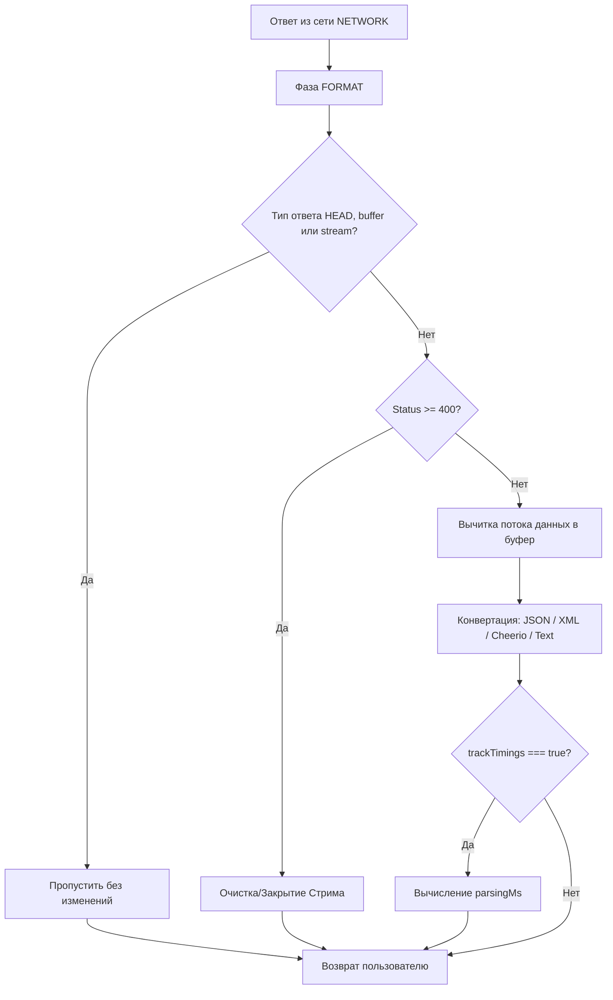

# @hyperttp/parser

Официальный плагин автоматического парсинга и
конвертации ответов для HTTP-клиента **Hyperttp**.
Работает на фазе `FORMAT`, вычитывает входящий поток данных (body stream) и
преобразует его в JavaScript-объекты, XML, строки или
структурированные JSON-объекты на основе заголовков `Content-Type` или
параметра `responseType`.

## Особенности

- 🤖 **Автоматическое определение (`auto`)**:
Самостоятельно распознает форматы `JSON`, `XML` и `Text`,
избавляя от необходимости вызывать `.json()` вручную.
- 🦅 **Парсинг HTML**:
При получении HTML-страниц автоматически парсит тело ответа через
`node-html-parser`, извлекая заголовок, мета-теги и структурированное содержимое.
- ⏱️ **Метрики производительности**: Точно замеряет время,
затраченное на десериализацию данных, и
сохраняет результат в `req.meta.timings.parsingMs` (при включенном `trackTimings`).
- 🧹 **Безопасная очистка (Stream Cleanup)**:
В случае ответов с ошибками (HTTP Status >= 400) или
сбоев вычитки плагин корректно закрывает/вызывает `cancel()` / `destroy()` у
нативных стримов, предотвращая утечки памяти.

## Установка

```bash
# С использованием bun
bun add @hyperttp/parser

# С использованием npm/pnpm
npm install @hyperttp/parser

```

## Использование

Плагин автоматически активируется на фазе `FORMAT` для всех типов запросов,
кроме `HEAD`, `buffer` и `stream`.

### Базовый пример

```typescript
import { HyperClient } from "@hyperttp/core";
import "@hyperttp/parser"; // Подключение расширения типов HttpClientOptions

const client = new HyperClient({
  responseConverter: {
    // Опции конфигурации парсера (передаются в экземпляр ResponseConverter)
    charset: "utf-8"
  }
});

// 1. Автоматический парсинг JSON
const jsonResult = await client.get<{ id: number }>("https://api.example.com/user/1");
console.log(jsonResult.id);

// 2. Автоматический парсинг HTML в Cheerio
const $ = await client.get<any>("https://example.com/page", {
  meta: { responseType: "html" } 
});
const pageTitle = $("head title").text();

```

### Мониторинг времени парсинга

Если активирован трекинг таймингов, плагин обогатит объект `meta`:

```typescript
const req = {
  url: "[https://api.example.com/heavy-data](https://api.example.com/heavy-data)",
  method: "GET",
  meta: { trackTimings: true }
};

const data = await client.execute(req);
console.log(Время парсинга: ${req.meta.timings?.parsingMs} ms);

```

## Как это работает (Архитектура)

Плагин перехватывает управление в момент возврата ответа из сети на фазе **`FORMAT`**:



## Лицензия

MIT © dirold2
